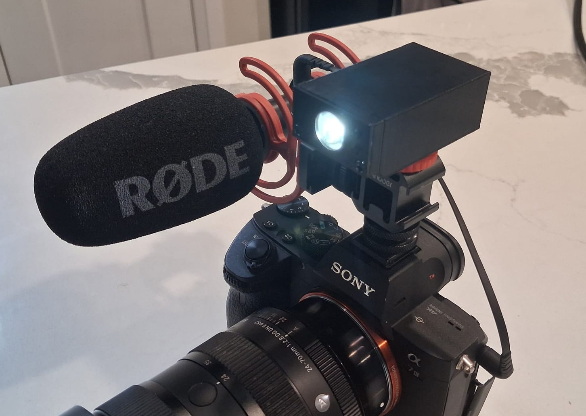
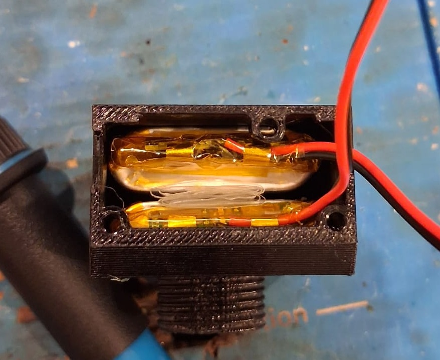

# CameraFlash

A compact camera-mounted flashlight/torch built for a Sony a7III, designed to sit on a cold shoe adapter. Brightness is adjustable across 15 levels via two buttons, with deep sleep between presses for extremely low idle current (~15µA).

---

## Hardware

| Component | Part | Role |
|:---|:---|:---|
| Microcontroller | ATtiny202-SSNR | Main controller (2KB flash) |
| LED Driver | LM2759 | I2C-controlled torch/flash driver |
| High Power LED | MHP2016SWDT-Q05 | Torch/flash output |
| Battery Charger | BQ25170DSGR | Single-cell LiPo charger via USB-C |
| Status LED | KT-0603R | Charge status indicator |
| Power Good LED | NCD0603B5 | Charger power-good indicator |
| USB-C Port | TYPE-C-31-M-12 | Charging input |
| Buttons | TS-1187A-B-A-B (x2) | Brightness up / brightness down |

I2C pull-ups are 4.7kΩ. Battery protection IC was removed — the body diode forward voltage drop was causing problems. Bulk capacitance footprints are populated partially to fill empty PCB space.

Schematic found [here](ELECTRICAL/Schematic_CameraFlashlight.pdf)

---

## Software

Built with PlatformIO using the megatinycore Arduino framework, compiled with `-Os` for size.

**Button behavior:**
- **Button 1 (PA7):** Brightness up — increments through 14 torch levels, wraps back to off
- **Button 2 (PA3):** Brightness down — decrements through levels, wraps around to max

The MCU enters sleep mode between button presses and wakes on a level-triggered pin interrupt, keeping idle current minimal.

Brightness is written to the LM2759 over I2C. At level 0 the driver is shut down; levels 1–14 set the torch current register and enable torch mode.

---

## Power

| Source | Idle Current | Condition |
|:---|:---|:---|
| ATtiny202 | 5 µA | Standby sleep |
| LM2759 | 9.7 µA | Shutdown |
| BQ25170 | 0.35 µA | Unplugged |
| **Total** | **~15 µA** | LED off |

With a 4000 mAh battery, idle battery life is approximately
$$
\begin{align}
\frac{Battery Capacity}{Current Consumption} =& Hours \\
\frac{4000 mAh}{0.00001505 A}=& Hours\\
265780 Hours \approx& 30 years
\end{align}
$$

---

## Mechanical

3D printed enclosure, 5 parts. Attaches via cold shoe. Assembly notes:

- Leave clearance for the USB-C cable before tightening everything down. Misalignment makes it impossible to plug in. when putting it in a knife will be required to open up the USB-C hole slightly so the hole can be the exact same size as the port
- Screws thread directly into the print; don't overtorque
- Lens sits in the front of the enclosure

| Hardware | Qty |
|:---|:---:|
| M4 socket head bolt, 14mm | 1 |
| M3 countersunk bolt, 10mm | 3 |
| Lens | 1 |

---

## Known Issue: Lens Shadow

The back of the lens can cast a circular shadow in photos when the flash is mounted on the camera body. My lens is giant so it is probably a much larger issue for me than it is normally.

**Workaround:** Mount the flash on a cold shoe 3-to-1 adapter above the camera body so the lens no longer blocks the light path.

## Battery Rattle Fix

The batteries have a small clearance gap between them and the case, causing them to rattle when the flash is moved. Folding up the plastic bag the batteries came in and wedging it between the two cells fills the gap perfectly. Problem solved + ReduceReuseRecycle

