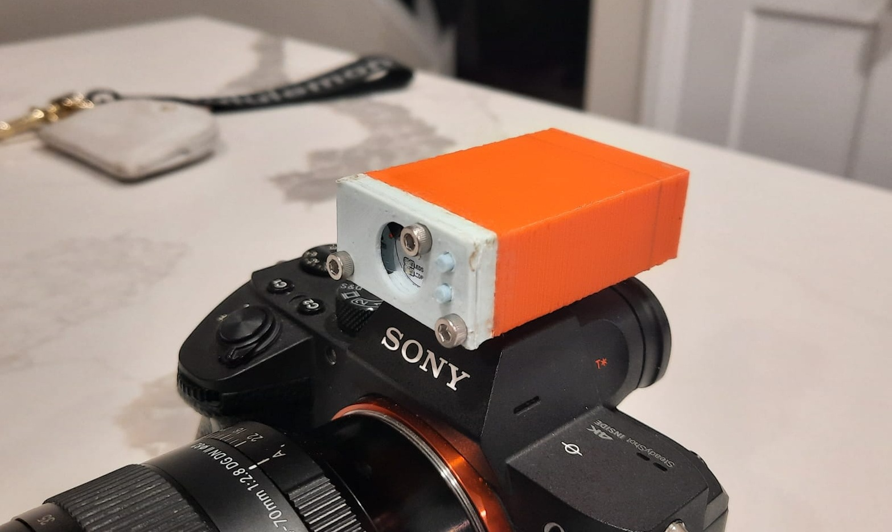
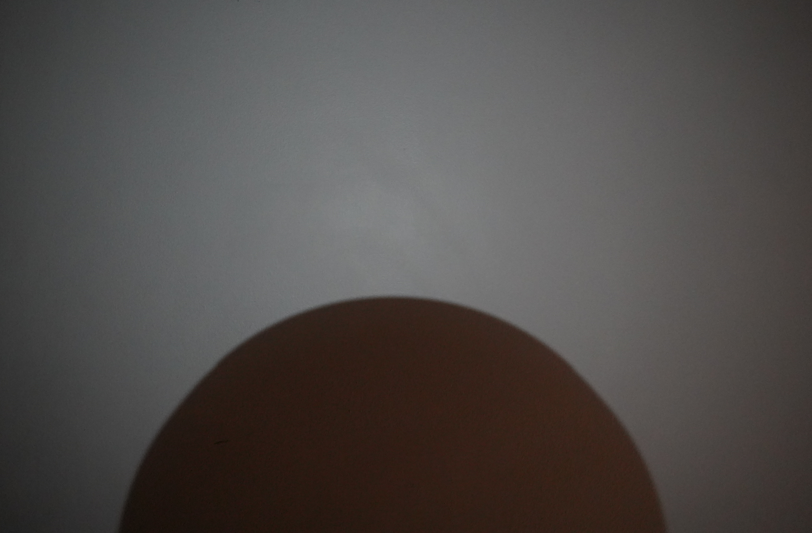

# CameraFlash

I bought a Sony a7III a while ago thinking I would be fine with no flash. I stand by this, but I do want a flashlight for video. ~~Might as well put in a flash function while I'm at it.~~ Do this yourself if you want. I left a pin open for it on the pcb.

### Hardware

ATTINY202 with a LM2759 led driver. New battery charger decreases idle battery consumption by ~4x. Also easier to solder. Added a lot of capacitors which I have no plan to populate. Just an option to stabilize voltage under bright flash.

### Software

Theres only 2 kB of program memory so it cant really be all that complicated. uC sets LED current through i2c. Buttons are pin interrupts.

## ToDo
### Mechanical lens size problem
First prototype has a problem where the back of the lens obscures the light from the flash from being in the photo. Here is a photo of a wall:

The circle is the backside of the lens casting a shadow

